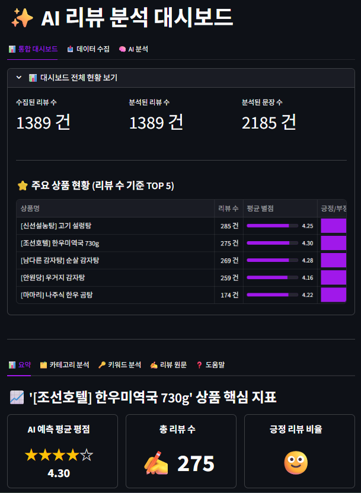
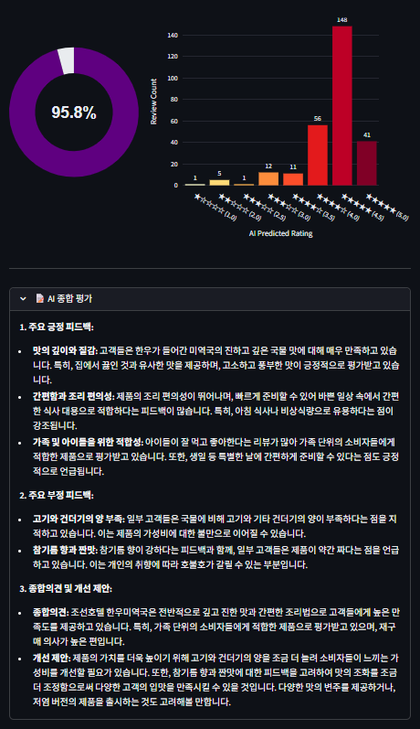
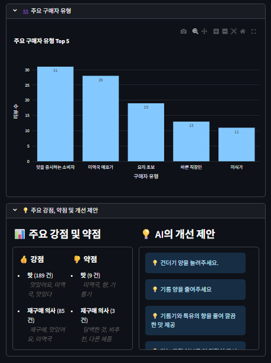
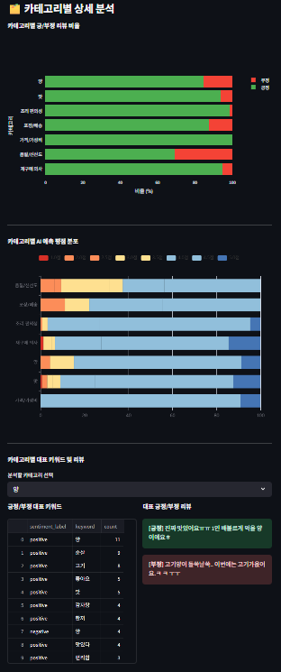
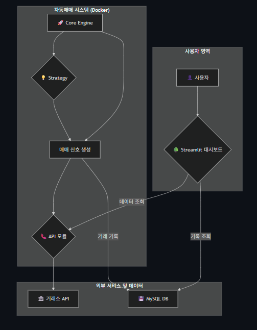
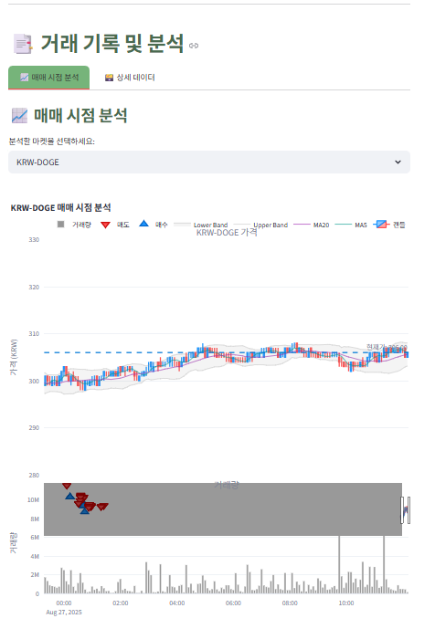

<h1 align="center">Charlee — Data / Business / Data Science Portfolio</h1>
<p align="center">
비즈니스 목표와 도메인 제약을 먼저 이해하고, 그 현실을 반영한 데이터 설계와 제품형 솔루션으로 연결합니다.<br/>
(이커머스 VOC 분석 · 실시간 트레이딩 시스템)
</p>

<p align="center">
  <a href="#-projects"></a>
  <a href="https://github.com/nimowa03/data-portfolio/actions/workflows/ci.yml"></a>
  <a href="#-tech-stack"></a>
  <a href="#-tech-stack"></a>
  <a href="LICENSE"></a>
</p>

---

## 🔗 Quick Links
- [Projects](#-projects) · [Screenshots](#-screenshots) · [Tech Stack](#-tech-stack) · [Domain-first Principles](#-domain-first-principles) · [What I bring](#-what-i-bring) · [Safety (Trading)](#%EF%B8%8F-safety-trading) · [Education & Contact](#-education--contact)

---

## 🔍 Positioning (Domain → Data → Product)
- **도메인 우선**: 고객의 언어(리뷰)·시장 미시구조(호가/레이트리밋) 같은 **현실 제약**을 먼저 파악합니다.  
- **데이터 모델링**: 그 제약을 반영해 스키마/라벨 체계/지표를 설계하고 **정합성·중복 방지·관측 가능성**을 확보합니다.  
- **제품형 결과물**: 대시보드·자동화 파이프라인 등 **의사결정이 바로 가능한 형태**로 제공합니다.  
  → 아래 두 프로젝트(VOC Analyzer, CoinTradeSystem)가 이 철학을 대표합니다.

---

## 📂 Projects

### 1) 🛒 VOC Analyzer — 고객의 소리(리뷰) 분석 대시보드
**도메인 관점**: 이커머스는 별점 평균보다 **무엇 때문에 만족/불만인지(양·맛·포장 등)**가 핵심입니다.  
**해결**: 리뷰를 자동 수집·정제하고, 감성/키워드/주제/개선제안을 추출하여 **의사결정 뷰**로 제공합니다.

- **카테고리 라벨 체계**: `양 · 맛 · 조리 편의성 · 포장/배송 · 가격/가성비 · 품질/신선도 · 재구매의사`
- **Stack**: Python, SQL(PostgreSQL), OpenAI API, LangChain, Streamlit, Docker
- **Repo/Path**: `projects/voc-analyzer/`

<details>
<summary><b>문제 정의 → 해결 → 결과 → 배운 점 → 나의 강점</b></summary>

- **문제 정의(도메인)**: “별점 4.3”은 좋지만, **무엇을 고치고 어디에 투자할지**는 말해주지 않습니다. 복합 문장(“맛은 좋지만 포장은 아쉽다”)도 단순 긍/부정으로는 손실이 큽니다.  
- **해결**  
  - 수집/전처리: 리뷰(상품/내용/평점/일자) 크롤링 → 중복/결측/정규화, **스키마 설계**  
  - 분석: OpenAI+LangChain으로 **감성(3라벨)·키워드·주제·개선제안** 동시 추출  
  - 시각화: **의사결정 중심 대시보드**(카테고리 드릴다운, 예시 문장, 트렌드/우선순위)  
  - 재현성: `schema.sql`, `requirements.txt`, `.env.example`, `docker-compose.yml`
- **결과**: 수천 건 리뷰에서 **핵심 개선 토픽**과 **우선순위**를 자동 정리 → 기획/CS/MD가 바로 **티켓 발행** 가능한 수준의 출력  
- **배운 점**: 정성 데이터는 라벨/용어 정의가 절반, **“보기 좋은 그래프”보다 결정 가능한 뷰**가 성과를 좌우  
- **나의 강점**: **도메인 라벨 체계 설계 → E2E 파이프라인 → 액션 연결**까지 스스로 완결
</details>

**Run (Local)**
```bash
conda create -n voc python=3.11 -y && conda activate voc
pip install -r projects/voc-analyzer/requirements.txt
cp projects/voc-analyzer/.env.example projects/voc-analyzer/.env  # 키 입력
psql -f projects/voc-analyzer/schema.sql
streamlit run projects/voc-analyzer/app.py
```

**.env.example (요약)**
```dotenv
PGHOST=localhost
PGPORT=5432
PGUSER=postgres
PGPASSWORD=postgres
PGDATABASE=voc
DB_URL=postgresql://${PGUSER}:${PGPASSWORD}@${PGHOST}:${PGPORT}/${PGDATABASE}
OPENAI_API_KEY=your-key
OPENAI_MODEL=gpt-4o-mini
```

---

### 2) 💹 CoinTradeSystem — 실시간 자동매매 파이프라인 (Live-ready with safety)
**도메인 관점**: 트레이딩은 알고리즘보다 **거래소 제약(호가단위, 레이트리밋, 체결 지연, 키 보안)**이 먼저입니다.  
**해결**: 스케줄러 중심의 **안정 파이프라인**을 설계하고, 주문 보정·재시도·관측성(로그/UUID)을 갖춘 뒤 전략을 얹었습니다.

- **Stack**: Python, APScheduler, MariaDB, Streamlit, Docker
- **Repo/Path**: `projects/cointradesystem/`

<details>
<summary><b>문제 정의 → 해결 → 결과 → 배운 점 → 나의 강점</b></summary>

- **문제 정의(도메인)**: 실시간 변동성+API 제약에서 **안전하게** 주문을 처리하고, 실패 시 **예측 가능하게** 복구해야 합니다.  
- **해결**  
  - 스케줄러(1분): `trading_cycle()` → 매수/매도 분리  
  - 실행 계층: **호가 단위 보정**, 실패 시 **취소-재발주/백오프**, **주문결과 조회**  
  - 래퍼/API: Upbit REST 캡슐화(레이트리밋 대응)  
  - 데이터: `buy_orders`·`sell_orders` 스키마로 **추적 가능한 로그** 확보  
  - 대시보드: **체결/자산/시그널** 모니터링
- **결과**: 쿼터/지연/중복/예외를 견디는 **실시간 파이프라인 운영 감각** 확보, 관측가능성 강화로 디버깅 비용 ↓  
- **배운 점**: 모델보다 먼저 **정합성·관측성·오퍼레이션**이 성패를 좌우  
- **나의 강점**: **제약 대응 문제해결**, **데이터 엔지니어링 감각**, **운영화(Docker/.env)**
</details>

**Run (Docker Compose)**
```bash
cp projects/cointradesystem/.env.example projects/cointradesystem/.env  # 키/DB 설정
docker compose -f projects/cointradesystem/docker-compose.yml up -d --build
# services: scheduler(core), mariadb, streamlit (http://localhost:8501)
```

**.env.example (요약)**
```dotenv
# Upbit API
UPBIT_OPEN_API_ACCESS_KEY=your-access-key
UPBIT_OPEN_API_SECRET_KEY=your-secret-key
UPBIT_OPEN_API_SERVER_URL=https://api.upbit.com

# MariaDB
DB_HOST=localhost
DB_PORT=3306
DB_USER=root
DB_PASSWORD=secret
DB_NAME=cointrade
```

---

## 📸 Screenshots

**VOC Analyzer**

| 개요 | 상품 종합 | 구매자 유형/강·약점 | 카테고리 상세 |
|---|---|---|---|
|  |  |  |  |

**CoinTradeSystem**

| 아키텍처/플로우 | 매매 시점 분석 |
|---|---|
|  |  |

> 스크린샷은 샘플/연구용 데이터 기준이며, 수집 범위에 따라 값이 달라질 수 있습니다.

---

## 🧰 Tech Stack
- **Language/Analysis**: Python, SQL, R, Statistics (EDA, Hypothesis Test)  
- **AI/LLM**: OpenAI API, LangChain (감성/키워드/주제 추출, RAG 기초)  
- **Data**: PostgreSQL, MariaDB, Pandas, NumPy  
- **Viz & App**: Streamlit, Tableau, Plotly/Matplotlib  
- **Ops**: Docker, docker-compose, Git/GitHub

---

## 🧭 Domain-first Principles
1) **비즈니스 가설을 데이터 구조로 번역**: 라벨/스키마/지표를 도메인 언어로 정의  
2) **관측가능성(Observability) 우선**: 로그/UUID/재현성 없이 좋은 인사이트는 없다  
3) **제품형 결과물**: “보기 좋음”이 아니라 **결정 가능한 뷰**(필터·드릴다운·주석·예시문)

---

## 🧩 What I bring
- **도메인 감각이 깔린 E2E 구현력**: 라벨 체계·스키마 설계 → 분석/모델 → 대시보드/파이프라인  
- **비즈니스 연결**: 인사이트를 **우선순위·KPI·실행 티켓**으로 매핑  
- **운영 안정성**: 레이트리밋/호가/키보안 등 **현실 제약 대응** 설계

---

## ⚠️ Safety (Trading)
- 본 저장소는 **학습·연구 목적**의 데모를 포함할 수 있습니다.  
- 실거래 전, **주문 한도/일일 한도/호가 단위 보정/취소-재발주** 로직을 반드시 점검하세요.  
- 키/토큰은 로컬 `.env`에만 보관하고 **공개 금지**.

---

## 📜 Education & Contact
- 한국방송통신대 **AI학과** (통계, Python, R)  
- 청년취업사관학교 **새싹×FinInsight** (SQL/수집/LLM·RAG/심화 프로젝트)

**Contact**  
Email: <nimowa03@gmail.com> · GitHub: <https://github.com/nimowa03> · LinkedIn: (추가)
