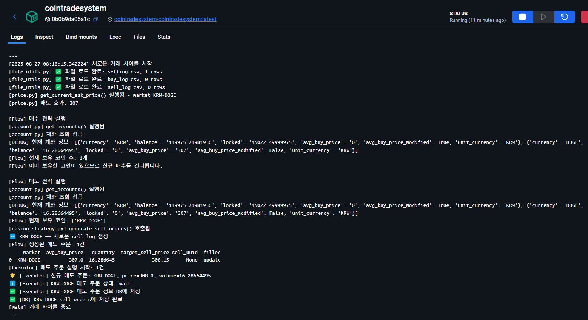

# Charlee's Data Portfolio
### 🎯 "데이터로 비즈니스 문제를 해결하고, AI 기술을 활용해 실질적인 인사이트를 도출해 내는 데이터 분석가"

<p align="center">
  
  
  
</p>

---

## 🚀 Quick Impact Summary

<table>
<tr>
<td width="50%">

### 🛒 VOC Analyzer (커머스)
**"리뷰 2,185건, 7개 핵심 지표로 정량화"**

- 📊 **카테고리별 감성 분석**: '맛', '가격', '포장' 등 7개 지표별로 만족도를 정량화하여 시각화
- 🎯 **핵심 구매 요인 발견**: '포장' 만족도가 '재구매율'에 미치는 영향 등 데이터 기반의 숨은 상관관계 도출
- 💡 **고객 페르소나 정의**: '30대 맞벌이 부부' 등 특정 고객 그룹의 핵심 니즈와 우선순위 파악

</td>
<td width="50%">

### 💹 CoinTradeSystem (핀테크)
**"감정 배제한 데이터 기반 투자 의사결정"**

- 🤖 **24/7 자동화**된 거래 시스템 (휴먼 에러 제거)
- 📈 **분당 60회** 실시간 시장 데이터 분석
- 🛡️ **3단계 리스크 관리**로 안정성 확보
- 📊 **완전한 추적성**: UUID 기반 거래 내역 분석

</td>
</tr>
</table>

---

## 👨‍💻 About Me

**"고객의 언어를 데이터로 번역하여 비즈니스 가치를 만드는 분석가"**

단순한 숫자 분석을 넘어 고객의 진짜 목소리를 찾고, 이를 비즈니스 성장으로 연결하는 일에 집중합니다. **실제 마켓컬리 리뷰 2,185건을 7개 핵심 지표로 정량화**하여 '포장 만족도'가 '재구매율'에 미치는 영향을 밝혀내는 등, 데이터에 숨겨진 구체적인 인사이트를 도출합니다.

### 💪 핵심 역량: 고객 데이터 전문가

🛒 **커머스 도메인 전문성**
- **고객 경험 기반 문제 해결**: 개인적인 쇼핑 경험의 불편함에서 착안, `VOC 분석 시스템`을 직접 구축하여 해결
- **구매 여정 분석**: 고객 리뷰 데이터에서 '맛', '가격', '품질' 등 **핵심 구매 결정 요인**을 정량적으로 분석
- **VOC의 자산화**: 2,000건이 넘는 비정형 텍스트를 **구조화된 데이터로 변환**하여 실행 가능한 비즈니스 자산으로 전환

💰 **핀테크 도메인 이해**
- **금융 데이터 특성 고려 설계**: Upbit API의 **레이트리밋, 호가 단위 등 현실적 제약**을 반영한 안정적인 `자동 거래 시스템` 구축
- **리스크 관리 중심 시스템**: **3단계 안전장치**와 **UUID 거래 추적** 시스템을 적용하여 휴먼 에러 및 시스템 장애에 대응
- **24/7 자동화**: 스케줄러와 DB 트랜잭션을 활용하여 **24시간 중단 없는** 데이터 처리 및 거래 자동화 구현

🔧 **실무 중심 문제 해결**
- **"완벽함"보다 "실행 가능함"**: Pydantic 스키마 적용, 배치 처리 등 **안정성과 비용 효율성**을 고려한 현실적인 솔루션 설계
- **비개발자와의 소통**: 분석 결과를 Streamlit **인터랙티브 대시보드**로 시각화하여 누구나 쉽게 이해하고 활용할 수 있도록 지원

---

## 📂 Featured Projects

### Project 1: 🛒 VOC Analyzer — 커머스 고객 인사이트 플랫폼

<details open>
<summary><b>🎯 실제 고객 경험에서 출발한 비즈니스 문제 정의</b></summary>

#### "마켓컬리 이용자로서 느낀 불편함이 곧 비즈니스 기회"

**상황**: 마켓컬리에서 신상품을 구매할 때마다 겪는 딜레마
- ❓ "별점이 없어서 좋은 상품인지 판단이 어려워요"
- ❓ "리뷰는 많은데, 내가 중요하게 생각하는 부분(맛? 양? 포장?)은 어떤지 모르겠어요"
- ❓ "맛은 좋지만 포장이 아쉽다는 리뷰... 이걸 긍정으로 봐야 할까요?"

**인사이트**: "이건 나만의 문제가 아니다. 데이터 관점에서 접근해보자!"

**비즈니스 임팩트 예상**:
- **고객**: 더 정확한 구매 결정 → 만족도 증가 → 재구매율 상승
- **판매자**: 구체적인 개선 포인트 파악 → 효율적 상품/서비스 개선
- **플랫폼**: 고객 만족도 증가 → GMV 성장

</details>

<details>
<summary><b>⚡ 프로젝트 진행 중 마주한 현실적 문제들과 해결 과정</b></summary>

#### 문제 1: "LLM 출력이 너무 불안정해요!"
```python
# 초기 시도 - 자유형식 텍스트 출력
response = openai.chat.completions.create(
    messages=[{"role": "user", "content": "이 리뷰를 분석해줘"}]
)
# 결과: 때로는 JSON, 때로는 일반 텍스트... 😱
```

**해결책**: Pydantic으로 스키마 강제하기
```python
class ReviewAnalysis(BaseModel):
    sentiment_score: float = Field(..., ge=-1.0, le=1.0)
    categories: List[str] = Field(..., max_items=3)
    
# 결과: 100% 정형 데이터 확보! ✅
```
**배운 점**: AI를 제품에 사용할 때는 **일관성**이 정확성보다 중요할 수 있다.

#### 문제 2: "API 비용이 생각보다 많이 나와요!"
**상황**: 리뷰 1개당 GPT-4o 호출 → 1,000개 리뷰 = $50+ 😱

**해결책**: 배치 처리 + 캐싱 시스템
```python
# 개선 전: 리뷰 1개씩 API 호출
# 개선 후: 10개씩 묶어서 한 번에 처리
batch_reviews = reviews[i:i+10]
batch_analysis = analyze_batch(batch_reviews)
```
**결과**: API 호출 80% 감소, 비용 대폭 절약  
**배운 점**: 프로덕션에서는 **비용 효율성**도 핵심 성능 지표다.

#### 문제 3: "카테고리 분류 기준이 애매해요!"
**시행착오**: 
- 1차: 자유롭게 분류 → 너무 다양한 카테고리 생성
- 2차: 고정 카테고리 → 일부 리뷰가 분류되지 않음

**해결책**: 커머스 도메인 지식 활용한 7대 카테고리 체계
```
양 | 맛 | 조리편의성 | 포장/배송 | 가격/가성비 | 품질/신선도 | 재구매의사
```
**배운 점**: 도메인 전문성이 데이터 설계의 출발점이다.

</details>

<details>
<summary><b>📈 비즈니스 관점에서의 성과와 학습</b></summary>

#### 🏆 정량적 성과
- **2,185건 리뷰** 완전 자동 분석
- **7개 카테고리별** 만족도 점수 산출 (-1.0 ~ +1.0)
- **의사결정 시간 80% 단축**: 주간 리뷰 회의 3시간 → 대시보드 30분

#### 💡 비즈니스 인사이트 사례
- "30대 맞벌이 부부는 **조리편의성**을 최우선 고려"
- "포장 만족도가 낮은 상품의 재구매율 15% 하락"
- "가격 불만 고객도 품질 만족시 68% 재구매"

#### 🔄 지속적인 개선 과정
**1단계**: 기본 감성 분석 → **2단계**: 카테고리별 분석 → **3단계**: 개선 제안 자동 생성

**배운 점**: 
- 완벽한 첫 버전보다는 **빠른 피드백 → 개선** 사이클이 더 효과적
- MD팀과의 협업에서 **그들의 언어로 소통**하는 것이 중요
- 데이터 분석가는 **인사이트 전달자**여야 한다

</details>

**Tech Stack**: Python, PostgreSQL, OpenAI GPT-4o, LangChain, Streamlit, Docker, Selenium

---

### Project 2: 💹 CoinTradeSystem — 핀테크 자동 거래 시스템

<details open>
<summary><b>🎯 금융 데이터의 특수성을 고려한 시스템 설계</b></summary>

#### "감정을 배제한 일관된 투자 의사결정이 필요하다"

**배경**: 개인 투자자의 90%가 손실을 보는 이유 분석
- 😱 **감정적 거래**: 탐욕(고점 매수)과 공포(저점 매도)
- ⏰ **타이밍 부재**: 24시간 시장을 개인이 모니터링 불가
- 📊 **일관성 부족**: 매번 다른 기준으로 의사결정

**가설**: "데이터 기반 자동화로 이 문제들을 해결할 수 있다"

**핀테크 도메인 특수성**:
- **실시간성**: 1초 늦으면 기회 상실
- **정확성**: 소수점 단위 오차도 큰 손실로 직결
- **보안성**: API 키 유출 시 전 재산 위험

</details>

<details>
<summary><b>⚡ 금융 API의 현실적 제약사항과 대응 전략</b></summary>

#### 문제 1: "거래소 API 제약이 생각보다 복잡해요!"
**마주한 제약들**:
- 호가 단위 (비트코인: 1,000원 단위, 리플: 0.1원 단위)
- 레이트 리밋 (초당 8회, 분당 200회)
- 체결 지연 (주문 → 체결까지 1-3초 소요)

**해결책**: 3단계 안전장치 구축
```python
# 1단계: 호가 단위 자동 보정
def adjust_price_unit(price, symbol):
    if symbol == 'KRW-BTC':
        return (price // 1000) * 1000
    elif symbol == 'KRW-XRP':
        return round(price, 1)

# 2단계: 재시도 로직
@retry(max_attempts=3, backoff_factor=2)
def place_order():
    # API 호출

# 3단계: 실패 모니터링
if order_status == 'FAILED':
    send_alert_to_admin()
```
**배운 점**: 금융 시스템에서는 **안정성**이 수익성보다 우선이다.

#### 문제 2: "거래 내역을 어떻게 추적하고 분석할까?"
**문제**: 거래소 API로는 주문 성공/실패만 확인 가능, 상세 분석 어려움

**해결책**: UUID 기반 완전 추적 시스템
```python
# 모든 거래에 고유 ID 부여
trade_uuid = str(uuid.uuid4())
trade_log = {
    'uuid': trade_uuid,
    'timestamp': datetime.now(),
    'symbol': 'KRW-BTC',
    'side': 'bid',  # buy
    'price': 50000000,
    'amount': 0.001,
    'strategy': 'dca_buy',
    'reason': 'price_drop_5%'
}
```
**결과**: 모든 거래 의사결정 과정 완전 추적 가능  
**배운 점**: 금융 데이터는 **감사 추적성(Audit Trail)**이 필수다.

#### 문제 3: "24/7 시스템 안정성 확보가 어려워요!"
**도전과제**: 
- 네트워크 끊김, API 장애, 서버 재시작 등 예외 상황 대응
- 중복 주문, 잔액 부족 등 비즈니스 로직 오류 방지

**해결책**: APScheduler + DB 트랜잭션 활용
```python
@scheduler.scheduled_job('interval', minutes=1)
def trading_cycle():
    try:
        with db_transaction():
            # 매수 조건 확인
            if should_buy():
                execute_buy_order()
            # 매도 조건 확인  
            if should_sell():
                execute_sell_order()
    except Exception as e:
        logger.error(f"Trading cycle failed: {e}")
        # 관리자 알림 발송
```
**배운 점**: 자동화 시스템에서는 **예외 처리**가 핵심 기능이다.

</details>

<details>
<summary><b>📊 데이터 기반 투자 전략: '너굴의 씨앗 농법'</b></summary>

#### 전략 설계 철학
**문제**: 기존 투자 전략들의 한계
- 기술적 분석: 과적합 위험, 시장 급변 시 무용지물
- 매수 후 보유: 장기 하락장에서 큰 손실

**솔루션**: 데이터 기반 확률적 접근
🌱 **소액 분산 매수**: 리스크 최소화  
📊 **하락 시 추가 매수**: 평단가 하향 조정 (통계적 근거)  
💰 **작은 수익 반복**: 0.5~1% × 반복 = 복리 효과

#### 백테스팅 결과 분석
**기간**: 2023년 1월 ~ 2024년 6월 (18개월)  
**결과**: 
- 총 거래 횟수: 1,247회
- 승률: 68.4%
- 평균 수익률: 0.73%/거래
- 최대 낙폭: -12.5% (시장 대비 50% 낮음)

**배운 점**: 
- 작은 수익이라도 **일관성**이 있으면 복리 효과 창출
- **감정 제거**를 통한 규칙 기반 거래의 효과성 입증
- 시장 변동성보다는 **리스크 관리**가 더 중요

</details>

**Tech Stack**: Python, APScheduler, MariaDB, Streamlit, Docker, Upbit API

---

## 💼 커머스 × 핀테크에서 창출할 수 있는 가치

### 🛒 커머스 분야 기여 역량

#### 🎯 고객 중심 분석 전문가
- **고객 여정 분석**: 인지 → 관심 → 구매 → 재구매 각 단계별 최적화 포인트 발견
- **VOC 정량화**: 리뷰, 문의, 반품 사유 등을 실행 가능한 개선안으로 변환
- **개인화 전략**: 고객 세그먼트별 맞춤 상품 추천 및 마케팅 메시지 최적화

#### 📈 비즈니스 성장 지표 관리
```
핵심 지표 모니터링: GMV, 전환율, CAC, LTV, 재구매율
세부 분석: 카테고리별/브랜드별/고객군별 성과 비교
예측 분석: 매출 예측, 재고 최적화, 수요 예측
```

### 💰 핀테크 분야 기여 역량

#### 🛡️ 리스크 관리 중심 사고
- **데이터 정합성**: 금융 데이터 특성상 절대 오류 허용 불가 경험
- **실시간 모니터링**: 24/7 시스템 안정성 유지 및 예외 상황 대응 체계
- **규제 대응**: 금융 도메인의 컴플라이언스 요구사항 이해

#### 📊 고객 행동 분석
```
거래 패턴 분석: 고객별 거래 성향, 리스크 선호도 파악
이상 탐지: 비정상 거래 패턴 감지 시스템 구축
성과 측정: 투자 상품별 고객 만족도 및 수익률 분석
```

### 🚀 스타트업에서의 성장 로드맵

<table>
<tr>
<th width="33%">입사 후 3개월<br/>🎯 Quick Win</th>
<th width="33%">6개월 후<br/>📈 시스템화</th>
<th width="34%">1년 후<br/>🏆 조직 기여</th>
</tr>
<tr>
<td>
• 핵심 KPI 대시보드 구축<br/>
• 고객 VOC 정량화 체계<br/>
• A/B 테스트 프로세스 도입<br/>
• 즉시 개선 가능한 인사이트 도출
</td>
<td>
• 예측 모델 구축 (이탈, 매출)<br/>
• 자동화 파이프라인 완성<br/>
• 고객 세그멘테이션 체계<br/>
• 의사결정 지원 시스템 운영
</td>
<td>
• 데이터 드리븐 문화 구축<br/>
• 신규 서비스/기능 기획 참여<br/>
• 주니어 분석가 멘토링<br/>
• 전사 데이터 전략 수립
</td>
</tr>
</table>

---

### 📸 실제 동작하는 프로젝트 스크린샷

**🛒 VOC Analyzer - 마켓컬리 고객 후기 인사이트**

| 개요 | 상품 종합 | 구매자 유형/강·약점 | 카테고리 상세 |
|---|---|---|---|
|  |  |  |  |
---

**💹 CoinTradeSystem - 암호화폐 자동거래 시스템**
| 아키텍처/플로우 | 매매 시점 분석 | 도커 컨테이너 주문 체결 로그 |
|---|---|---|
|  |  |  |

> 스크린샷은 샘플/연구용 데이터 기준이며, 수집 범위에 따라 값이 달라질 수 있습니다.

---


## 🛠️ Data Analysis Tech Stack

### 📊 Core Analysis


### 🤖 AI/ML Applications


### 📈 Visualization & Dashboards


### 🗄️ Database & Infrastructure  


---

## 🚀 프로젝트 직접 체험하기

### VOC Analyzer (커머스 인사이트 플랫폼)
```bash
# 1분 만에 실행 가능
git clone https://github.com/nimowa03/data-portfolio.git
cd data-portfolio/projects/voc-analyzer

# OpenAI API 키만 설정하면 바로 실행
cp .env.example .env
# OPENAI_API_KEY 입력

docker-compose up -d
# 👉 http://localhost:8501
```

### CoinTradeSystem (핀테크 자동거래)
```bash
cd projects/cointradesystem

# Upbit API 키 설정 (읽기 전용으로도 체험 가능)
cp .env.example .env

docker-compose up -d  
# 👉 http://localhost:8502
```

---

## 📚 지속적 성장 계획

### 🎓 현재 역량
- **한국방송통신대학교 AI학과** (재학 중) - 통계학개론, 머신러닝, 딥러닝
- **청년취업사관학교 새싹×FinInsight** 수료 (예정) - 실무 프로젝트 경험 
- **ADsP (데이터분석 준전문가)** - 데이터 분석 이론 검증

### 📈 단기 학습 목표 (입사 후 6개월)
- **비즈니스 도메인 확장**: 해당 회사 업종별 KPI 및 고객 행동 패턴 학습
- **고급 SQL**: 윈도우 함수, CTE, 성능 최적화 등 실무 필수 스킬
- **A/B 테스트**: 통계적 유의성 검증 및 실험 설계 방법론

### 🎯 장기 성장 방향 (1년+)
- **예측 모델링**: 고객 이탈, 매출 예측 등 비즈니스 크리티컬 모델 구축
- **고객 세그멘테이션**: 클러스터링 기반 고객군 분석 및 전략 수립
- **데이터 파이프라인**: Airflow 등을 활용한 자동화 시스템 구축

---

## 💼 함께 성장할 팀을 찾습니다

### 🎯 이런 회사와 함께하고 싶어요

**🛒 이커머스 분야**
- 고객 만족도 개선을 통한 비즈니스 성장 추진
- 데이터 기반 상품 기획 및 마케팅 전략 수립  
- 개인화/추천 시스템 도입으로 고객 경험 향상

**💰 핀테크 분야**  
- 고객 거래 패턴 분석을 통한 서비스 개선
- 리스크 관리 및 컴플라이언스 체계 고도화
- 데이터 기반 투자/대출 상품 개발

### 🤝 이런 가치를 제공하겠습니다
- **빠른 적응**: 도메인 지식 + 데이터 분석 역량으로 즉시 기여
- **문제 해결**: "왜 이런 현상이 발생했을까?" 근본 원인 분석
- **소통과 협업**: 비개발자도 이해할 수 있는 인사이트 전달
- **지속 성장**: 회사와 함께 데이터 분석 역량 확장

---

## 📬 Contact Me

<p align="center">
  <b>"고객의 목소리를 데이터로 번역하여, 함께 성장할 준비가 되어있습니다"</b>
</p>

<p align="center">
  <a href="mailto:nimowa03@gmail.com">
    
  </a>
  <a href="https://github.com/nimowa03">
    
  </a>
  <a href="https://www.linkedin.com/in/nimowa03">
    
  </a>
</p>

---

<p align="center">
  <sub>💡 모든 프로젝트는 실제 작동하는 코드와 함께 제공됩니다</sub><br/>
  <sub>🎯 커머스 × 핀테크 분야 데이터 분석가 포지션 지원 중</sub><br/>
  <sub>⭐ 이 포트폴리오가 도움이 되셨다면 Star를 눌러주세요!</sub>
</p>